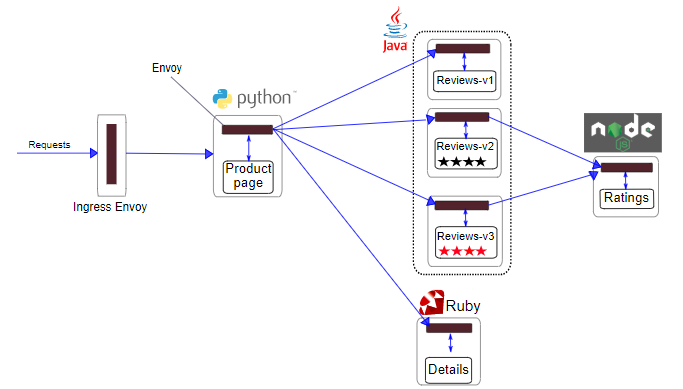

# Bookinfo 示例

来源于：<https://github.com/istio/istio/tree/master/samples/bookinfo>

该示例部署了一个用于演示多种 Istio 特性的应用，该应用由四个单独的微服务构成。 这个应用模仿在线书店的一个分类，显示一本书的信息。 页面上会显示一本书的描述，书籍的细节（ISBN、页数等），以及关于这本书的一些评论。

`Bookinfo` 应用分为四个单独的微服务：

- `productpage`：这个微服务会调用 `details` 和 `reviews` 两个微服务，用来生成页面。
- `details`：这个微服务中包含了书籍的信息。
- `reviews`：这个微服务中包含了书籍相关的评论。它还会调用 `ratings` 微服务。
- `ratings`：这个微服务中包含了由书籍评价组成的评级信息。

`reviews` 微服务有 3 个版本：

- v1 版本不会调用 `ratings` 服务。
- v2 版本会调用 `ratings` 服务，并使用 1 到 5 个黑色星形图标来显示评分信息。
- v3 版本会调用 `ratings` 服务，并使用 1 到 5 个红色星形图标来显示评分信息。

下图展示了这个应用的端到端架构。



**Note**: We need the owner of the PR to perform the appropriate testing with built/pushed images to their own docker repository before we would build/push images to the official Istio repository.

## Build docker images

```bash
cd samples/bookinfo
src/build-services.sh <version> <prefix>
```

Where `<version>` is the tag and `<prefix>` is the docker registry to tag the images.

For example:

```bash
$ src/build-services.sh 1.16.3 docker.io/shamsher31
Sending build context to Docker daemon  1.218MB
Step 1/16 : FROM python:3.7.7-slim
3.7.7-slim: Pulling from library/python
8559a31e96f4: Pull complete
...
Successfully built 1b293582cc2e
Successfully tagged shamsher31/examples-bookinfo-ratings-v2:1.16.3
Successfully tagged shamsher31/examples-bookinfo-ratings-v2:latest
```

The bookinfo versions are different from Istio versions since the sample should work with any version of Istio.

## Push docker images to docker hub

After the local build is successful, you need to update the YAML file with the latest tag that you used during the build eg: `1.16.3`.

Run the following script to build the docker images, push them to docker hub, and to update the YAML files in one step.

```bash
./build_push_update_images.sh <version> <prefix>
```

For example:

```bash
$ ./build_push_update_images.sh 1.16.3 --prefix=shamsher31
...
1.16.3: digest: sha256:70634d3847a190b9826975c8 size: 3883
Pushing: shamsher31/examples-bookinfo-reviews-v2:1.16.3
The push refers to a repository [docker.io/shamsher31/examples-bookinfo-reviews-v2]
...
```

Verify that expected tag eg: `1.16.3` is updated in `platform/kube/bookinfo*.yaml` files.

## Tests

Test that the bookinfo samples work with the latest tag eg: `1.16.3` that you pushed.

```bash
$ cd ../../
$ kubectl apply -f samples/bookinfo/platform/kube/bookinfo.yaml
serviceaccount/bookinfo-details created
deployment.apps/details-v1 created
serviceaccount/bookinfo-ratings created
...
```

Wait for all the pods to be in `Running` start.

```bash
$ kubectl get pods
NAME                              READY   STATUS    RESTARTS   AGE
details-v1-7f556f5c6b-485l2       2/2     Running   0          10m
productpage-v1-84c8f95c8d-tlml2   2/2     Running   0          10m
ratings-v1-66777f856b-2ls78       2/2     Running   0          10m
reviews-v1-64c47f4f44-rx642       2/2     Running   0          10m
reviews-v2-66b6b95f44-s5nt6       2/2     Running   0          10m
reviews-v3-7f69dd7fd4-zjvc8       2/2     Running   0          10m
```

Once all the pods are in the `Running` state. Test if the bookinfo works through cli.

```bash
$ kubectl exec -it "$(kubectl get pod -l app=ratings -o jsonpath='{.items[0].metadata.name}')" -c ratings -- curl productpage:9080/productpage | grep -o "<title>.*</title>"
<title>Simple Bookstore App</title>
```

You can also test it by hitting producpage in the browser.

```bash
http://192.168.39.116:31395/productpage
```

You should see the following in the browser.


**Note**: If everything works as mentioned above, request a new official set of images be built and pushed from the reviewer, and add another commit to the original PR with the version changes.

Bookinfo is tested by istio.io integration tests. You can find them under [tests](https://github.com/istio/istio.io/tree/master/tests) in the [istio/istio.io](https://github.com/istio/istio.io) repository.
